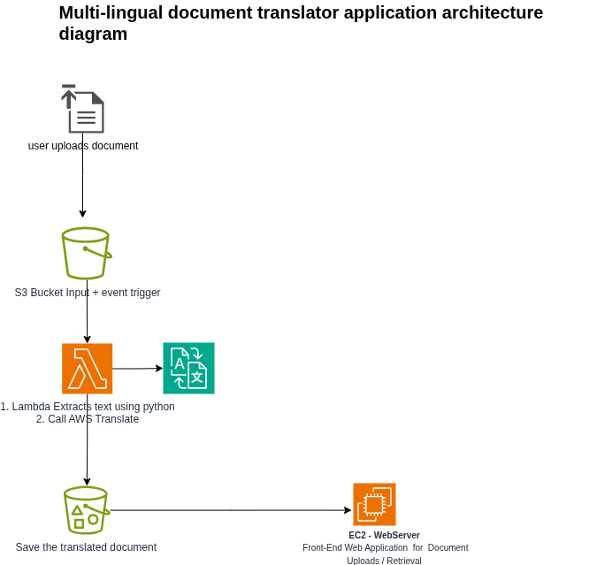

# Multi-lingual document translation 

This project implements a **serverless multilingual translation pipeline** on AWS.
It accepts **JSON documents** containing text blocks and language metadata, translates them into multiple target languages using **Amazon Translate**, and stores the translated results in Amazon S3.

The project is deployed using **Terraform** for Infrastructure-as-Code (IaC).

---

## Features

* Upload **JSON files** describing text blocks and target languages.
* Automatic translation using **AWS Lambda + Amazon Translate**.
* Store translated results as **JSON** in an output S3 bucket.
* Web UI (Flask app on EC2) to:

  * Upload input JSON files.
  * List available translated JSON results.
  * Download translations via presigned S3 URLs.
* Infrastructure deployed using **Terraform**.
--

---

##  Architecture Diagram.


---

##  Technologies Used

* **AWS Lambda** – JSON processing + translation
* **Amazon S3** – Input/output storage (2 storage.)
* **Amazon Translate** – Multilingual translation
* **IAM** – Roles and security policies
* **Flask (Python)** – Web UI for uploads/downloads
* **Terraform** – Infrastructure as Code
* **Boto3** – AWS SDK for Python

--

##  Deployment


### **1. Deploy Infrastructure**
Set the terminal to the project directory

Directory structure
```
multilingual-document-translation /
├── terraform/
│ └── 1-provider.tf
│	└── 2-bucket.tf
│	└── 3.lambda.tf
|   └── 4.appserver.tf
│	└── outputs.tf
│	└── variable.tf
└── lambda/
|    └── lambda_function.py
└── flask-app/
      └── app.py
      └── index.html
```


### **1. Terraform**

```bash
cd terraform
terraform init
terraform apply
```

### **2. Package Lambda Code**

```bash
cd lambda
zip lambda.zip lambda_function.py
#terraform copy the lambda.zip to the cloud.
```

---

##  Usage

1. Start the Flask app (if running on EC2, it auto-runs at startup):

   ```bash
   nohup python3 app.py &
   ```
2. Open the UI → `http://<ec2-public-ip>:5000/`
3. Upload a JSON file.
4. Wait for translations to complete (Lambda triggers automatically).
5. Download translated JSON files from the output list.


---

## Example Input JSON

```json
{
  "source_lang": "en",
  "target_langs": ["fr", "es", "de"],
  "text_blocks": [
    "Hello world",
    "This is AWS Translate",
    "Lambda makes serverless easy"
  ]
}
```
---
## Example Output JSON

```json
{
  "source_lang": "en",
  "translations": {
    "fr": [
      "Bonjour le monde",
      "Ceci est AWS Translate",
      "Lambda facilite le sans serveur"
    ],
    "es": [
      "Hola mundo",
      "Esto es AWS Translate",
      "Lambda facilita el serverless"
    ],
    "de": [
      "Hallo Welt",
      "Dies ist AWS Translate",
      "Lambda macht serverlos einfach"
    ]
  }
}
```
---
##  Future Enhancements

* Support additional input formats (CSV, TXT).
*  Add user authentication via AWS Cognito.
*  Store metadata and translation history in DynamoDB.
*  Add CI/CD pipeline with CodePipeline.

---

